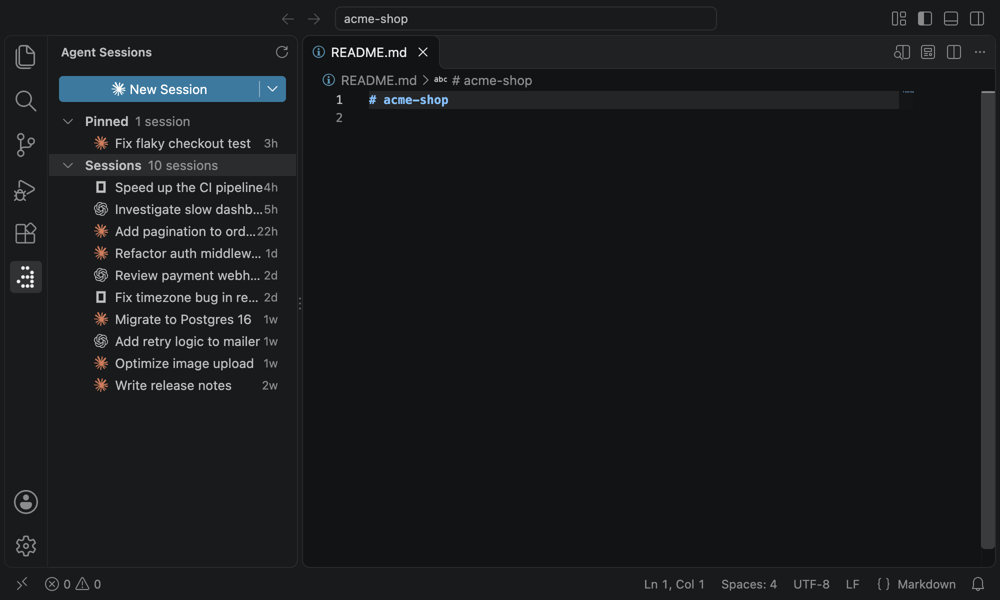

# Agent Sessions

**Every Claude Code, Codex and OpenCode conversation of your project, one click away.**

You start a session, switch branches, close the window, and a few days later you can't remember which conversation had the answer. Agent Sessions puts all of them in a panel in your Activity Bar, newest first, so you can jump back in without digging through `claude --resume` or `codex resume`.



## Why you'll like it

- **All your agents in one list.** Claude Code, Codex and OpenCode sessions side by side, each with its own icon and the time of the last activity.
- **Back in the conversation in one click.** Click a session and it resumes in an editor tab, named after the session. No terminal commands to remember.
- **New session, your agent.** Press **New Session** to start the selected agent right in your project. Switch agents from the dropdown next to the button.
- **Your sessions, your way.** Pin the ones you keep coming back to and rename the ones with unhelpful titles. Right-click a session.
- **Nothing gets lost.** Close VS Code with a few sessions open and they come back when you reopen the project.
- **Titles you already know.** Names come from the agents: Claude Code's AI titles and `/rename`, Codex thread names and OpenCode session titles.

## Getting started

1. Install the extension and open a project folder.
2. Click the **Agent Sessions** icon in the Activity Bar. Your existing sessions are already there.
3. Click a session to continue it, or press **New Session**.

Works with multi-root workspaces too: sessions from every folder are listed, and new ones start in the folder you're working in.

## Requirements

- VS Code 1.101 or newer
- macOS or Linux
- At least one of [Claude Code](https://docs.claude.com/en/docs/claude-code), [Codex CLI](https://github.com/openai/codex) or [OpenCode](https://opencode.ai), installed and signed in

## Settings

Most people never need to change anything. If you do:

| Setting | What it does |
| --- | --- |
| `agentSessions.agents` | Change an agent's command, turn it off, or add your own. |
| `agentSessions.claudeProjectsPath` | Use a different Claude Code projects folder (default `~/.claude/projects`). |

For example, to start Codex with web search and hide Claude from the New Session menu:

```jsonc
"agentSessions.agents": [
  { "id": "codex", "command": "codex --search" },
  { "id": "claude", "enabled": false }
]
```

Agents you add yourself show up in the New Session menu. Their past sessions are not listed.

## Good to know

- **Private by design.** Agent Sessions only reads the session files already on your machine and never sends anything anywhere.
- **Renames are local.** A name you set here is saved in VS Code and isn't written back to the agent.
- **New Codex and OpenCode sessions.** A brand-new session shows up in the list after your first message.
- **Untrusted folders.** In Restricted Mode the extension won't start or resume agents.

## License

[MIT](LICENSE)

## Feedback

Something broken, or an agent you'd like to see? [Open an issue](https://github.com/hopleus/vscode-agent-sessions/issues).

---

*Agent Sessions is an independent project and is not affiliated with Anthropic, OpenAI or JetBrains. Claude and Claude Code are trademarks of Anthropic; Codex and OpenAI are trademarks of OpenAI; OpenCode is a trademark of its respective owner.*
